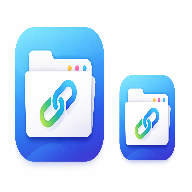

<div align="center">

# 🧰 Herramientas Omega



### Portal web para centralizar herramientas de soporte, enlaces corporativos y consultas de infraestructura.


</div>

---

# 📖 Descripción

**Herramientas Omega** es una aplicación web desarrollada para facilitar el acceso a herramientas internas utilizadas por el equipo de soporte.

Toda la información es administrada desde **Google Sheets**, permitiendo actualizar enlaces y datos sin modificar el código de la aplicación.

Además, el proyecto funciona como una **Progressive Web App (PWA)**, permitiendo instalarla como aplicación de escritorio o móvil.

---

# ✨ Funcionalidades

- 📌 Portal principal de herramientas.
- 🔗 Consulta de Links de Soporte.
- 🔗 Consulta de Links GANA.
- 🌐 Consulta del Consolidado de Internet.
- 🔍 Búsqueda rápida en tablas.
- 📱 Instalación como aplicación (PWA).
- ☁ Despliegue automático con GitHub + Vercel.
- 📊 Datos obtenidos desde Google Sheets.
- ⚡ Actualización automática mediante Service Worker.
- 📱 Diseño Responsive.

---

# 📸 Capturas

## Página principal

> Agregue la imagen en:

```
screenshots/home.png
```

```text
screenshots/
    home.png
```

---

## Links Soporte

```
screenshots/soporte.png
```

---

## Links GANA

```
screenshots/gana.png
```

---

## Consolidado Internet

```
screenshots/internet.png
```

---

# 🏗 Arquitectura

```
                Google Sheets
                      │
                      │
              Google Apps Script
                      │
                JSON (API REST)
                      │
────────────────────────────────────
              Herramientas Omega
────────────────────────────────────
     │           │            │
     │           │            │
Links Soporte  Links GANA  Consolidado
     │
     ▼
 Progressive Web App (PWA)
```

---

# 🚀 Tecnologías

| Tecnología | Uso |
|------------|-----|
| HTML5 | Estructura |
| CSS3 | Diseño |
| JavaScript | Lógica |
| Google Apps Script | API |
| Google Sheets | Base de datos |
| DataTables | Tablas |
| jQuery | DataTables |
| Service Worker | Caché |
| Manifest | PWA |
| Vercel | Hosting |
| GitHub | Control de versiones |

---

# 📂 Estructura del proyecto

```
Herramientas/
│
├── css/
│
├── icons/
│   ├── icon-192.png
│   └── icon-512.png
│
├── screenshots/
│
├── index.html
├── links_Soporte.html
├── links_Gana.html
├── internet.html
│
├── admin.html
├── adminLinksGana.html
│
├── manifest.json
├── sw.js
│
└── README.md
```

---

# 🧩 Módulos

## 🏠 Inicio

Página principal desde donde se accede a todos los módulos del sistema.

---

## 🔧 Links Soporte

Permite consultar los enlaces utilizados por el área de soporte.

Los datos provienen de Google Sheets.

---

## 🔗 Links GANA

Consulta de enlaces relacionados con la plataforma GANA.

Incluye un panel administrativo para crear, editar y eliminar enlaces.

---

## 🌐 Consolidado Internet

Consulta de más de mil registros de servicios de Internet.

Campos disponibles:

- Código SV
- Nombre SV
- Dirección
- Municipio
- Identificador
- Capacidad
- Tecnología
- Proveedor

Cuenta con búsqueda instantánea mediante DataTables.

---

# 📱 Progressive Web App

La aplicación puede instalarse desde Chrome como una aplicación nativa.

Características:

- ✔ Instalación en Windows.
- ✔ Instalación en Android.
- ✔ Funciona sin conexión para archivos principales.
- ✔ Icono personalizado.
- ✔ Pantalla independiente.
- ✔ Actualización automática.

---

# 🔄 Actualizaciones

El proyecto utiliza un **Service Worker** para controlar el caché.

Cada versión cambia el nombre del caché:

```javascript
const CACHE_NAME = "omega-cache-v2";
```

De esta forma los usuarios reciben automáticamente la versión más reciente.

---

# ☁ Despliegue

El proyecto se encuentra conectado con GitHub y Vercel.

Cada vez que se realiza:

```bash
git add .
git commit -m "Nueva actualización"
git push origin main
```

Vercel genera automáticamente un nuevo despliegue.

---

# 📊 Fuente de datos

Los datos son administrados desde Google Sheets.

La comunicación se realiza mediante Google Apps Script retornando información en formato JSON.

```
Google Sheets
      │
      ▼
Apps Script
      │
      ▼
 JSON
      │
      ▼
Herramientas Omega
```

---

# 💻 Instalación local

Clonar el repositorio:

```bash
git clone https://github.com/OscarArB/Herramientas.git
```

Entrar al proyecto:

```bash
cd Herramientas
```

Abrir con Visual Studio Code.

Instalar Live Server.

Ejecutar:

```
Go Live
```

---

# 👨‍💻 Desarrollador

## Oscar ArB

Desarrollador Web

### Portafolio

https://mi-portafolio-omega-puce.vercel.app/

---

# ⭐ Próximas mejoras

- [ ] Tema oscuro.
- [ ] Dashboard administrativo.
- [ ] Estadísticas de uso.
- [ ] Notificaciones Push.
- [ ] Inicio de sesión con Google.
- [ ] Reportes en PDF.
- [ ] Exportación a Excel.

---

# 📄 Licencia

Proyecto desarrollado para uso interno del equipo de soporte.

**© 2026 Oscar ArB. Todos los derechos reservados.**
